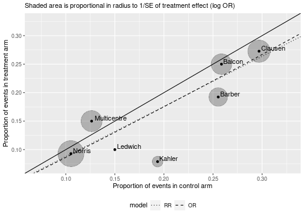
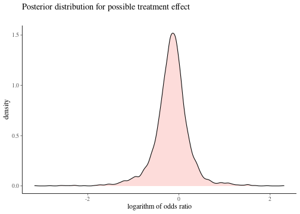
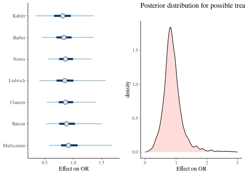
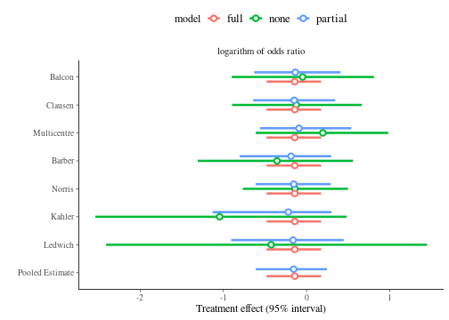

This vignette is written for _baggr_ users who want to analyse binary data. For more general introduction to meta-analysis concepts and _baggr_ workflow, please read `vignette("baggr")`.

Here, we will show how to:

* Run meta-analysis of summary odd ratio (OR) or risk ratio (RR) data.
* Prepare standard outputs for the above.
* Convert individual-level data to summary-level and correct for rare events.
* Run meta-analysis directly on individual-level data.
* Model impact of covariates.


## Other questions you should consider

There are certain aspects of modelling binary data that are not yet covered by _baggr_, but may be important for your data:

* Directly modelling parameters relating to proportions (see "Model 3" in this [comprehensive tutorial with Stan](https://mc-stan.org/users/documentation/case-studies/pool-binary-trials.html))
* [Understanding biases in reporting](https://handbook-5-1.cochrane.org/chapter_10/10_addressing_reporting_biases.htm)
* Modelling data on rates, ordered categorical data and more with generalised linear models. A good overview and examples are provided by [NICE DSU at University of Sheffield](https://nicedsu.sites.sheffield.ac.uk/).


# Basic meta-analysis of binary data

Typically, a meta-analysis of binary data is done on summary statistics such as $\log(OR)$ or $\log(RR)$. The reason for this is two-fold: 1) they are the statistics most commonly reported by studies and 2) they are approximately normally distributed. The second assumption needs to be treated carefully, as we will show later.


For the first example we will use a simple summary data based on (part of) Table 6 in @yusuf_beta_1985, a famous study of impact of beta blockers on occurrence of strokes and mortality.


```r
df_yusuf <- read.table(text="
       trial  a n1i  c n2i
      Balcon 14  56 15  58
     Clausen 18  66 19  64
 Multicentre 15 100 12  95
      Barber 10  52 12  47
      Norris 21 226 24 228
      Kahler  3  38  6  31
     Ledwich  2  20  3  20
", header=TRUE)
```

In a typical notation, `a` (`c`) are numbers of events in treatment (control) groups, while `n1` (`n2`) are total patients in treatment (control) group. We can also calculate $b = n_1 - a$ and $d = n_2 - c$, i.e. numbers of "non-events" in treatment and control groups respectively.

In our examples we will use OR metric; $\log(OR)$ and its SE can easily be calculated from the values (if you're not familiar with OR, [see here](https://en.wikipedia.org/wiki/Odds_ratio#Statistical_inference)):


```r
# This is a calculation we could do by hand:
# df <- df_yusuf
# df$b <- df$n1i-df$a
# df$d <- df$n2i-df$c
# df$tau <- log((df$a*df$d)/(df$b*df$c))
# df$se <- sqrt(1/df$a + 1/df$b + 1/df$c + 1/df$d)

# But prepare_ma() automates these operations:
df_ma <- prepare_ma(df_yusuf, group = "trial", effect = "logOR")
df_ma
#>         group  a  n1  c  n2   b   d         tau        se
#> 1      Balcon 14  56 15  58  42  43 -0.04546237 0.4303029
#> 2     Clausen 18  66 19  64  48  45 -0.11860574 0.3888993
#> 3 Multicentre 15 100 12  95  85  83  0.19933290 0.4169087
#> 4      Barber 10  52 12  47  42  35 -0.36464311 0.4855042
#> 5      Norris 21 226 24 228 205 204 -0.13842138 0.3147471
#> 6      Kahler  3  38  6  31  35  25 -1.02961942 0.7540368
#> 7     Ledwich  2  20  3  20  18  17 -0.46262352 0.9735052
```

We use `tau` and `se` notation for our effect, same as we would for analysing continuous data with `baggr()`. In fact, the model we use for logOR is the same default "Rubin" model (@rubin_estimating_1974) with partial pooling. Once $\log(OR)$ and is SE have been calculated, there are no differences between this process and analysis continuous quantities in _baggr_.


```r
bg_model_agg <- baggr(df_ma, effect = "logarithm of odds ratio")
```

The argument we specified, `effect`, does not impact results, but it makes outputs nicer, as we will see in the next section.

As with continuous quantities, the prior is chosen automatically. However, it is important to review the automatic prior choice when analysing quantities on log scale, because the priors may be needlessly diffuse (in other words, when using the command above _baggr_ does not "know" that data are logged, although it does try to adjust the scale of priors).


# Choice of summary statistic

We summarised our data as log(OR). Alternatively, we could work with log(RR). Risk difference is also a simple model that could be useful in some cases. Each model makes different assumptions on how the treatment of interest works. How do we choose the appropriate model for our data?

The basic tool that can help us choose is a `labbe` plot (introduced by @labbe_meta-analysis_1987), which is built into _baggr_:


```r
labbe(df_ma, plot_model = TRUE, shade_se = "or")
#> Warning: There were 7 divergent transitions after warmup. See
#> https://mc-stan.org/misc/warnings.html#divergent-transitions-after-warmup
#> to find out why this is a problem and how to eliminate them.
#> Warning: Examine the pairs() plot to diagnose sampling problems
#> Warning: There were 3 divergent transitions after warmup. See
#> https://mc-stan.org/misc/warnings.html#divergent-transitions-after-warmup
#> to find out why this is a problem and how to eliminate them.
#> Warning: Examine the pairs() plot to diagnose sampling problems
#> Warning: Removed 1 row(s) containing missing values (geom_path).
```



When we make the plot, two Bayesian models are run, one for OR and one for RR. The mean treatment effect from these 2 lines is then used to plot the dotted/dashed lines corresponding to OR and RR estimates. In our case we can see that there is no meaningful difference between the two models, given the size of the effect and estimates.


## Using risk ratios instead of odds ratios

Risk ratio is also normally distributed and can be easily calculated from contingency tables (i.e. `a`, `b`, `c`, `d` columns). All of the analysis flow would be identical in that case -- with exception of interpretation of treatment effect, of course.

Before we present the results for the OR model, a reminder on how risk and odd ratios compare. If an event is rare (rule of thumb: up to 10%), OR and RR will be similar. For really rare events there is no difference. The higher the event rate, the more discrepancy, e.g.


```r
a <- 9; b <- 1; c <- 99; d <- 1
cat("Risk ratio is", (a/(a+b))/(c/(c+d)), "\n" )
#> Risk ratio is 0.9090909
cat("Odds ratio is", a*d/(b*c), "\n")
#> Odds ratio is 0.09090909
```


```r
a <- 10; b <- 20; c <- 100; d <- 100
cat("Risk ratio is", (a/(a+b))/(c/(c+d)), "\n" )
#> Risk ratio is 0.6666667
cat("Odds ratio is", a*d/(b*c), "\n")
#> Odds ratio is 0.5
```

We can illustrate the similarities and differences of OR and RR with one example:


```r
par(mfrow = c(2,3), oma = rep(2,4))
for(es in c(1, .9, .8, .5, .25, .1)){
  p_bsl    <- seq(0,1,length=100)
  p_trt_rr <- es*p_bsl
  odds_trt <- es*(p_bsl/(1-p_bsl))
  p_trt_or <- odds_trt / (1 + odds_trt)
  plot(p_trt_or ~ p_bsl, type = "l",
       xlab = "control event rate", ylab = "treatment event rate", main = paste0("RR=OR=",es))
  lines(p_trt_rr ~ p_bsl, lty = "dashed")
}
title(outer = TRUE, "Compare RR (dashed) and OR (solid) of the same magnitude")
```


A very good discussion of these choices and intuitive plots are provided by @deeks_issues_2002 (see especially Figures 1-3).


# Visualising and criticising model results

All of the outputs are explained in more detail in the "main" package vignette, `vignette("baggr")`. Here, I simply illustrate their behaviour.


```r
bg_model_agg
#> Model type: Rubin model with aggregate data 
#> Pooling of effects: partial 
#> 
#> Aggregate treatment effect (on logarithm of odds ratio), 7 groups:
#> Hypermean (tau) =  -0.16 with 95% interval -0.61 to 0.24 
#> Hyper-SD (sigma_tau) = 0.2405 with 95% interval 0.0086 to 0.7934 
#> Total pooling (1 - I^2) = 0.84 with 95% interval 0.35 to 1.00 
#> 
#> Treatment effects on logarithm of odds ratio:
#>               mean   sd  2.5%   50% 97.5% pooling
#> Balcon      -0.125 0.26 -0.65 -0.13  0.41    0.77
#> Clausen     -0.149 0.24 -0.63 -0.15  0.34    0.74
#> Multicentre -0.074 0.26 -0.55 -0.09  0.52    0.76
#> Barber      -0.197 0.27 -0.79 -0.18  0.30    0.80
#> Norris      -0.150 0.22 -0.60 -0.15  0.28    0.69
#> Kahler      -0.254 0.34 -1.07 -0.21  0.31    0.89
#> Ledwich     -0.178 0.33 -0.91 -0.16  0.45    0.92
```

Default plot (`plot(bg_model_agg)`) will show pooled group results. If you prefer a typical forest plot style, you can use `forest_plot`, which can also plot comparison with source data (via `print` argument):


```r
forest_plot(bg_model_agg, show = "both", print = "inputs")
```


Hypothetical treatment effect in a new trial is obtained through `effect_plot`.


```r
effect_plot(bg_model_agg)
```



We can transform printed and plotted outputs to show exponents (or other transforms); for example:


```r
gridExtra::grid.arrange(
  plot(bg_model_agg, transform = exp) + xlab("Effect on OR"),
  effect_plot(bg_model_agg, transform = exp) + xlim(0, 3) + xlab("Effect on OR"),
  ncol = 2)
```



## Model comparison

We can compare with no pooling and full pooling models using `baggr_compare`


```r
# Instead of writing...
# bg1 <- baggr(df_ma, pooling = "none")
# bg2 <- baggr(df_ma, pooling = "partial")
# bg3 <- baggr(df_ma, pooling = "full")

# ...we use this one-liner
bg_c <- baggr_compare(df_ma, effect = "logarithm of odds ratio")
```


```r
plot(bg_c)
```



We can also examine the compared models directly, by accessing them via `$models`. This is useful e.g. for `effect_plot`:


```r
effect_plot(
  "Partial pooling, default prior" = bg_c$models$partial,
  "Full pooling, default prior" = bg_c$models$full) +
  theme(legend.position = "bottom")
```


You can use leave-one-out cross-validation to compare the models quantitatively. See documentation of `?loocv` for more details of calculation.


```r
a <- loocv(df_ma, pooling = "partial")
b <- loocv(df_ma, pooling = "full")
#a; b; #you can print out individual loocv() calculations
loo_compare(a,b) #...but typically we compare them to each other
```


# Model for individual-level binary data

Let's assume that you have access to underlying individual-level data. In our example above, we do not, but we can create a data.frame with individual level data since we know the contingency table. In practice this is not necessary as _baggr_ will do the appropriate conversions behind the scenes, but for our example we will convert our data by hand. Fortunately, a built-in function, `binary_to_individual` can do the conversion for us:


```r
df_ind <- binary_to_individual(df_yusuf, group = "trial")
head(df_ind)
#>    group treatment outcome
#> 1 Balcon         1       1
#> 2 Balcon         1       1
#> 3 Balcon         1       1
#> 4 Balcon         1       1
#> 5 Balcon         1       1
#> 6 Balcon         1       1
```

We can now use a logistic regression model


```r
bg_model_ind <- baggr(df_ind, model = "logit", effect = "logarithm of odds ratio")
```

> Note: as in other cases, `baggr()` will detect model appropriately (in this case by noting that `outcome` has only 0's and 1's) and notify the user, so in everyday use, it is not necessary to set `model = "logit"` . Alternatively, if we wrote `baggr(df_yusuf, model = "logit")`, the conversion to individual-level data would be done automatically behind the scenes.

> Note: The results of this vignette hosted on CRAN may have short run time due to server constraints. We recommend replicating this example yourself.

If we denote binary outcome as $y$, treatment as $z$ (both indexed over individual units by $i$), under partial pooling the logistic regression model assumes that

$$
y_i \sim \text{Bernoulli}(\text{logit}^{-1}[\mu_{\text{group}(i)} + \tau_{\text{group}(i)}z_i])
$$

where $\mu_k$'s and $\tau_k$'s are parameters to estimate. The former is a group-specific mean probability of event in untreated units. We are primarily interested in the latter, the group-specific treatment effects.

Under this formulation, odds ratio of event between treatment and non-treatment are given by $\tau_k$.  This means, the modelling assumption is the same as in the model of summary data we saw above. Moreover, _baggr_'s default prior for $\tau_k$ is set in the same way for summary and individual-level data (you can see it as `bg_model_ind$formatted_prior`). One difference is that parameter $\mu$ is estimated. However, unless dealing with extreme values of $\mu$, i.e. with rare or common events (which we discuss below), this should not impact the modelled result.

Therefore, the result we get from the two models will be close (albeit with some numerical variation):


```r
baggr_compare(bg_model_agg, bg_model_ind)
#> 
#> Mean treatment effects:
#>              2.5%      mean    97.5%    median       sd
#> Model 1 -0.605019 -0.162915 0.244295 -0.157839 0.209193
#> Model 2 -0.587963 -0.181417 0.212353 -0.170242 0.200992
#> 
#> SD for treatment effects:
#>               2.5%     mean    97.5%   median       sd
#> Model 1 0.00857239 0.240516 0.793390 0.184136 0.220761
#> Model 2 0.01398310 0.248458 0.754895 0.196801 0.206958
#> 
#> Posterior predictive effects:
#>              2.5%      mean    97.5%    median       sd
#> Model 1 -0.964813 -0.167740 0.575672 -0.160182 0.397482
#> Model 2 -0.975281 -0.158639 0.678598 -0.157997 0.398030
```

There will be difference in speed -- in our example logistic model has to work with 1101 rows of data, while the summary level model only had 7 datapoints. Therefore in "standard" cases you are better off summarising your data and using the faster aggregate data model.


## When to use summary and when to use individual-level data

To sum up:

* If you have no covariates and no particular priors on proportion of events in control groups, you are better off using a summary-level model. We will show how you can summarise your data in the next section.
* If your data includes covariates or events are rare, consider the logistic model. We will show why below.

> Note: as shown above, you can only create input data for the logistic model from `a`, `b`/`n1`, `c`, `d`/`n2` columns. You cannot do it from OR data only, as the probability in the untreated is then unknown.


## How to summarise individual-level data

In the previous example we analysed individual-level data and suggested that typically it is sufficient to work with summarised data, e.g. to speed up modelling. Summarising is also essential as it allows us to better understand the inputs and use diagnostics such as L'Abbe plot.

The generic function for doing this in _baggr_ is `prepare_ma`. It can be used with both continuous and binary data. In our case we can summarise `df_ind` to obtain either odds ratios or risk ratios:


```r
prepare_ma(df_ind, effect = "logOR")
#>         group  a  n1  c  n2   b   d         tau        se
#> 1      Balcon 14  56 15  58  42  43 -0.04546237 0.4303029
#> 2     Clausen 18  66 19  64  48  45 -0.11860574 0.3888993
#> 3 Multicentre 15 100 12  95  85  83  0.19933290 0.4169087
#> 4      Barber 10  52 12  47  42  35 -0.36464311 0.4855042
#> 5      Norris 21 226 24 228 205 204 -0.13842138 0.3147471
#> 6      Kahler  3  38  6  31  35  25 -1.02961942 0.7540368
#> 7     Ledwich  2  20  3  20  18  17 -0.46262352 0.9735052
prepare_ma(df_ind, effect = "logRR")
#>         group  a  n1  c  n2   b   d         tau        se
#> 1      Balcon 14  56 15  58  42  43 -0.03390155 0.3209310
#> 2     Clausen 18  66 19  64  48  45 -0.08483888 0.2782276
#> 3 Multicentre 15 100 12  95  85  83  0.17185026 0.3598245
#> 4      Barber 10  52 12  47  42  35 -0.28341767 0.3779232
#> 5      Norris 21 226 24 228 205 204 -0.12472076 0.2836811
#> 6      Kahler  3  38  6  31  35  25 -0.89674614 0.6643991
#> 7     Ledwich  2  20  3  20  18  17 -0.40546511 0.8563488
```

In both cases the effect (OR or RR) and its SE were renamed to `tau` and `se`, so that the resulting data frame can be used directly as input to `baggr()`.

For already summarised data, you can use the same function to move between different effect measures. For example you can take OR measures `a <- prepare_ma(df_ind, effect = "logOR")` and convert them to RR by using `prepare_ma(a, effect = "logRR")`.


# Rare events

Consider data on four fictional studies:


```r
df_rare <- data.frame(group = paste("Study", LETTERS[1:5]),
                      a = c(0, 2, 1, 3, 1), c = c(2, 2, 3, 3, 5),
                      n1i = c(120, 300, 110, 250, 95),
                      n2i = c(120, 300, 110, 250, 95))

df_rare
#>     group a c n1i n2i
#> 1 Study A 0 2 120 120
#> 2 Study B 2 2 300 300
#> 3 Study C 1 3 110 110
#> 4 Study D 3 3 250 250
#> 5 Study E 1 5  95  95
```

In Study A you can see that no events occurred in `a` column.

We have shown above how `prepare_ma()` can be used to summarise the rates (if we work with individual-level data) and calculate/convert between log OR's and log RR's. It can also be used to apply corrections to event rates, which it does automatically:


```r
df_rare_logor <- prepare_ma(df_rare, effect = "logOR")
#> Applied default rare event correction (0.25) in 1 study
# df_rare_logor <- prepare_ma(df_rare_ind, effect = "logOR")
df_rare_logor
#>     group    a     n1    c     n2      b      d       tau        se
#> 1 Study A 0.25 120.25 2.25 120.25 120.25 118.25 -2.213996 2.1121593
#> 2 Study B 2.00 300.00 2.00 300.00 298.00 298.00  0.000000 1.0033501
#> 3 Study C 1.00 110.00 3.00 110.00 109.00 107.00 -1.117131 1.1626923
#> 4 Study D 3.00 250.00 3.00 250.00 247.00 247.00  0.000000 0.8214401
#> 5 Study E 1.00  95.00 5.00  95.00  94.00  90.00 -1.652923 1.1053277
```


Note how the output of `prepare_ma` now differs from the original `df_rare` for "Study A": a (default) value of 0.25 was added, because there were no events in treatment arm. That means $\log(OR)=\log(0)=-\infty$. It is typical to [correct for rare events](https://handbook-5-1.cochrane.org/chapter_16/16_9_rare_events_including_zero_frequencies.htm) when analysing summary level data. A great overview of the subject and how different meta-analysis methods perform is provided by @bradburn_much_2007. You can modify the amount of correction by setting the `rare_event_correction` argument.


```r
pma01 <- prepare_ma(df_rare, effect = "logOR",
                            rare_event_correction = 0.1)
pma1 <- prepare_ma(df_rare, effect = "logOR",
                            rare_event_correction = 1)
pma01
#>     group   a    n1   c    n2     b     d       tau        se
#> 1 Study A 0.1 120.1 2.1 120.1 120.1 118.1 -3.061315 3.2392876
#> 2 Study B 2.0 300.0 2.0 300.0 298.0 298.0  0.000000 1.0033501
#> 3 Study C 1.0 110.0 3.0 110.0 109.0 107.0 -1.117131 1.1626923
#> 4 Study D 3.0 250.0 3.0 250.0 247.0 247.0  0.000000 0.8214401
#> 5 Study E 1.0  95.0 5.0  95.0  94.0  90.0 -1.652923 1.1053277
```

It is important to compare different models with different `rare_event_correction` values:


```r
bg_correction01 <- baggr(pma01, effect = "logOR")
bg_correction025 <- baggr(df_rare_logor, effect = "logOR")
bg_correction1 <- baggr(pma1, effect = "logOR")
bg_rare_ind <- baggr(df_rare, model = "logit", effect = "logOR")
```


```r
bgc1 <- baggr_compare(
  "Correct by .10" = bg_correction01,
  "Correct by .25" = bg_correction025,
  "Correct by 1.0" = bg_correction1,
  "Individual data" = bg_rare_ind
)
bgc1
#> 
#> Mean treatment effects:
#>                     2.5%      mean    97.5%    median       sd
#> Correct by .10  -2.70398 -0.753023 0.674475 -0.694474 0.838080
#> Correct by .25  -2.26608 -0.742129 0.584836 -0.722846 0.719274
#> Correct by 1.0  -2.15741 -0.618068 1.023320 -0.631084 0.755007
#> Individual data -2.64113 -0.929849 0.668471 -0.911063 0.824092
#> 
#> SD for treatment effects:
#>                      2.5%     mean   97.5%   median       sd
#> Correct by .10  0.0177378 0.959757 3.39848 0.750324 0.861504
#> Correct by .25  0.0384505 1.063410 4.11807 0.763478 1.070040
#> Correct by 1.0  0.0329805 1.004390 4.92225 0.652966 1.171820
#> Individual data 0.0349456 1.172040 4.24633 0.825124 1.160010
#> 
#> Posterior predictive effects:
#>                     2.5%      mean   97.5%    median      sd
#> Correct by .10  -4.01842 -0.679351 2.48408 -0.656091 1.64866
#> Correct by .25  -4.52444 -0.739573 2.27194 -0.693313 1.64132
#> Correct by 1.0  -4.47885 -0.668808 3.20455 -0.650789 1.81634
#> Individual data -4.65405 -0.915919 2.89771 -0.883682 1.87335
plot(bgc1) + theme(legend.position = "right")
```


> Note: The results of this vignette hosted on CRAN have very short run time (`iter = 500, chains = 2`) due to server constraints. We recommend replicating this example yourself.

Note in the result above that:

1. The heterogeneity estimate ("SD for treatment effects") is impacted by the corrections
2. Mean treatment effect estimates are less prone to the correction, but there is a sizeable difference between the logistic model and the aggregate data models
3. As corrections tend to 0, the estimates of $\log(OR)$ for Study A are more diffuse, but there is still a big difference between the logistic model and the aggregate data model with correction of 0.1.

We will explore the last point in more detail soon. First, however, let us note that the issue with modelling rare events is not limited to zero-events. As mentioned, $\log(OR)$ is approximately Gaussian. The quality of the approximation will depend on probabilities in all cells of the contingency table (which we estimate through `a`, `b`, `c`, `d`). Therefore, treating $\log(OR)$ as Gaussian might lead to different results in the individual-level vs summary-level models if the events are rare. With low counts in our example it will definitely be the case.

Let us generate similar data as above but now without the 0 cell:


```r
df_rare <- data.frame(group = paste("Study", LETTERS[1:5]),
                      a = c(1, 2, 1, 3, 1), c = c(2, 2, 3, 3, 5),
                      n1i = c(120, 300, 110, 250, 95),
                      n2i = c(120, 300, 110, 250, 95))

df_rare_logor <- prepare_ma(df_rare, effect = "logOR")
```


```r
bg_rare_agg <- baggr(df_rare_logor, effect = "logOR")
bg_rare_ind <- baggr(df_rare, effect = "logOR", model = "logit")
```

Let's compare again, both on group level but also in terms of hypothetical treatment effect:


```r
bgc2 <- baggr_compare(
  "Summary-level (Rubin model on logOR)" = bg_rare_agg,
  "Individual-level (logistic model)"    = bg_rare_ind
)
bgc2
#> 
#> Mean treatment effects:
#>                                          2.5%      mean    97.5%    median       sd
#> Summary-level (Rubin model on logOR) -1.94548 -0.585752 0.724152 -0.581461 0.648320
#> Individual-level (logistic model)    -3.09468 -0.889111 0.490872 -0.813052 0.809773
#> 
#> SD for treatment effects:
#>                                           2.5%     mean   97.5%   median      sd
#> Summary-level (Rubin model on logOR) 0.0334031 0.903707 3.40474 0.658301 0.89623
#> Individual-level (logistic model)    0.0459693 1.334200 4.17433 0.980046 1.15069
#> 
#> Posterior predictive effects:
#>                                          2.5%      mean   97.5%    median      sd
#> Summary-level (Rubin model on logOR) -3.34983 -0.558504 2.36593 -0.563172 1.42744
#> Individual-level (logistic model)    -5.12003 -0.925070 2.55994 -0.716017 1.75899
plot(bgc2)
```


The results are still a bit different.


# Pooling baseline event rates

So far we've been using the logistic model with default priors (that are zero-centered and scaled to data). Our justification was that the priors on treatment effects are the same for both individual-level and aggregate-level data models. However, recall the logistic model includes additional $K$ parameters, log odds of event in the control arms. (For simplicity we refer to them as baselines.) There are different ways in which we can assign them priors:

1. Default independent prior for each baseline, which is scaled to input data
2. Custom independent prior for baseline event rates, specified by using `prior_control` argument when callin `baggr`, using the same syntax as for other priors, e.g. `normal(0, 5)`.
3. Assuming hierarchical structure on baselines and specifying a prior using `prior_control` (which is now interpreted as hypermean, rather than $K$ independent priors) and `prior_control_sd` (hyper-SD for baseline parameters). To enable the hierarchical structure of baselines we need to specify `pooling_control = "partial"` (analogously to specifying `pooling` argument for treatment effects).

Choosing between the three is especially important in the case of rare events, as this will have a potentially large impact on the results. Let's continue with the example from previous section and  consider three models:

* default settings (already fitted above, `bg_rare_ind`),
* strongly informative independent prior on baselines: centered on 1% event rate, $\mathcal{N}(-4.59, 2^2)$, which translates 95% confidence that baseline event rate is between about 0.02% and 55%
* hierarchical prior on baselines (mean $\mathcal{N}(-4.59, 1)$, SD $\mathcal{N}(0, 2^2)$).

We exaggerate our prior choices on purpose, to best illustrate the differences.


```r
bg_rare_pool_bsl <- baggr(df_rare, effect = "logOR", model = "logit",
                        pooling_control = "partial",
                        prior_control = normal(-4.59, 1), prior_control_sd = normal(0, 2))
bg_rare_strong_prior <- baggr(df_rare, effect = "logOR", model = "logit",
                        prior_control = normal(-4.59, 10))
```


```r
bgc3 <- baggr_compare(
  "Rubin model" = bg_rare_agg,
  "Independent N(0,10^2)" = bg_rare_ind,
  # "Prior N(-4.59, 2^2)" = bg_rare_prior2,
  "Hierarchical prior" = bg_rare_pool_bsl,
  "Independent N(-4.59, 10^2)" = bg_rare_strong_prior
)

bgc3
#> 
#> Mean treatment effects:
#>                                2.5%      mean    97.5%    median       sd
#> Rubin model                -1.94548 -0.585752 0.724152 -0.581461 0.648320
#> Independent N(0,10^2)      -3.09468 -0.889111 0.490872 -0.813052 0.809773
#> Hierarchical prior         -2.14186 -0.740844 0.254811 -0.700894 0.579543
#> Independent N(-4.59, 10^2) -1.82379 -0.645795 0.745659 -0.639694 0.637678
#> 
#> SD for treatment effects:
#>                                 2.5%     mean   97.5%   median       sd
#> Rubin model                0.0334031 0.903707 3.40474 0.658301 0.896230
#> Independent N(0,10^2)      0.0459693 1.334200 4.17433 0.980046 1.150690
#> Hierarchical prior         0.0275920 0.630592 2.17551 0.466585 0.608303
#> Independent N(-4.59, 10^2) 0.0315284 0.914055 3.94275 0.673099 0.956118
#> 
#> Posterior predictive effects:
#>                                2.5%      mean   97.5%    median      sd
#> Rubin model                -3.48004 -0.578322 2.49292 -0.577400 1.47288
#> Independent N(0,10^2)      -5.64709 -0.853340 2.58903 -0.741446 1.97250
#> Hierarchical prior         -2.93429 -0.698360 1.32625 -0.684154 1.04955
#> Independent N(-4.59, 10^2) -3.44956 -0.643598 2.13206 -0.602449 1.45931
plot(bgc3) + theme(legend.position = "right")
```


> Note: The results of this vignette hosted on CRAN have very short run time (`iter = 500, chains = 2`) due to server constraints. We recommend replicating this example yourself. __In particular for hierarchical prior on baselines, we recommend longer runs.__

We can see that

1. The hierarchical prior offers us balance between the rare event corrections on aggregate data and the logit models without any corrections.
2. The default prior choice can have different behaviour in tails (for specific studies) than the prior that explicitly moved the baseline to 1%.
3. The differences between different logistic models may be smaller than between all logistic models and the aggregate data model, but there are still differences. Remember that all of the logistic models above make exactly the same assumptions on treatment effect and they differ only in their priors concerning baseline probabilities.

Each of the models considered could now be compared using `loocv()` (see the example earlier in the vignette) and their out-of-sample performance can be assessed.


# Accounting for covariates: meta-regression and mixed models

This section provides only a short example. To learn more about meta-regression see e.g. @baker_understanding_2009

Two types of covariates may be present in your data:

* Covariates that __change according to group unit__. In that case, the model accounting for the group covariates is a [meta-regression](https://handbook-5-1.cochrane.org/chapter_9/9_6_4_meta_regression.htm) model. It can be modelled on summary-level data.
* Covariates that __change according to individual unit__. Then, the model can be called a [mixed model](https://stats.stackexchange.com/questions/4700/what-is-the-difference-between-fixed-effect-random-effect-and-mixed-effect-mode/252888). It has to be fitted to individual-level data. Note that the first case can also be accounted for by using a mixed model.

In both cases we only need to name one extra argument to `baggr`: `covariates=`, followed by a vector of column names in input data. You should remember that your treatment effect estimate will vary a lot not only with choice of covariates, but also the contrasts that you use.


```r
#let's use the data.frame we created from Yusuf et al earlier
df_ma$study_grouping      <- c(1,1,1,0,0,0,0)
df_ma$different_contrasts <- c(1,1,1,0,0,0,0) - .5
bg_cov1 <- baggr(df_ma, covariates = c("study_grouping"), effect = "logarithm of odds ratio")
```


```r
baggr_compare("No covariate" = bg_model_agg,
              "With covariates, 0-1 coding" = bg_cov1)
#> Compared models use different covariates. Hyperparameters are not directly comparable.
#> 
#> Mean treatment effects:
#>                                  2.5%      mean    97.5%    median       sd
#> No covariate                -0.605019 -0.162915 0.244295 -0.157839 0.209193
#> With covariates, 0-1 coding -1.039390 -0.365897 0.253964 -0.351934 0.325934
#> 
#> SD for treatment effects:
#>                                   2.5%     mean    97.5%   median       sd
#> No covariate                0.00857239 0.240516 0.793390 0.184136 0.220761
#> With covariates, 0-1 coding 0.01290070 0.297448 0.941128 0.229047 0.260303
#> 
#> Posterior predictive effects:
#>                                  2.5%      mean    97.5%    median       sd
#> No covariate                -0.942887 -0.167027 0.543012 -0.160454 0.374641
#> With covariates, 0-1 coding -1.450800 -0.358236 0.610761 -0.334643 0.511801
#> 
#> Mean (SD) for covariates:
#>         model      study_grouping
#>  No covariate 0.374354 (0.460231)
```

To access the covariate estimates, see `fixed_effects()` function. They are also printed out by default:


```r
bg_cov1
#> Model type: Rubin model with aggregate data 
#> Pooling of effects: partial 
#> 
#> Aggregate treatment effect (on logarithm of odds ratio), 7 groups:
#> Hypermean (tau) =  -0.37 with 95% interval -1.04 to 0.25 
#> Hyper-SD (sigma_tau) = 0.297 with 95% interval 0.013 to 0.941 
#> Total pooling (1 - I^2) = 0.79 with 95% interval 0.28 to 1.00 
#> 
#> Treatment effects on logarithm of odds ratio:
#>                mean   sd  2.5%     50% 97.5% pooling
#> Balcon      -0.0025 0.31 -0.63  0.0011  0.60    0.71
#> Clausen     -0.0304 0.30 -0.63 -0.0249  0.55    0.68
#> Multicentre  0.0675 0.30 -0.52  0.0579  0.68    0.70
#> Barber      -0.3485 0.33 -1.00 -0.3424  0.29    0.74
#> Norris      -0.2634 0.26 -0.78 -0.2642  0.28    0.62
#> Kahler      -0.4622 0.43 -1.47 -0.4083  0.26    0.85
#> Ledwich     -0.3764 0.43 -1.34 -0.3487  0.43    0.89
#> 
#> Covariate (fixed) effects on logarithm of odds ratio:
#>                mean   sd
#> study_grouping 0.37 0.46
```

> Note: in the example above we did not manually set priors for $\beta$ coefficients. Users can do it by passing argument `prior_beta` to `baggr()`.

# References
