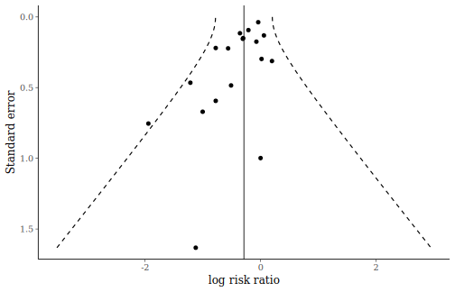

This vignette shows a short worked example of assessing and adjusting for publication
bias in a meta-analysis using _baggr_. It assumes that users are already familiar with
publication bias, funnel plots, and selection models.

# Data

We use the vitamin A supplementation and child mortality
data from @imdad_vitamin_2022, included in _baggr_ as `vitamin_a`.

For this example, the outcome is the log risk ratio for all-cause child mortality.
Negative values indicate lower mortality in the vitamin A supplementation arm.


``` r
head(vitamin_a)
#>            group     tau      se
#> 1   Agarwal 1995  0.1972 0.31210
#> 2   Barreto 1994  0.0000 0.99840
#> 3      Benn 1997 -0.7763 0.59370
#> 4 Chowdhury 2002 -1.9419 0.75420
#> 5  Daulaire 1992 -0.3011 0.14990
#> 6     DEVTA 2013 -0.0408 0.03726
summary(exp(vitamin_a$tau))
#>    Min. 1st Qu.  Median    Mean 3rd Qu.    Max.
#>  0.1434  0.4600  0.7175  0.6885  0.9525  1.2180
```

See `?vitamin_a` for more information.

The studies are heterogeneous and vary substantially in precision.

First fit the usual Rubin summary-data model. We label the estimand as a log
risk ratio so that plots and summaries are easier to read.


``` r
bg_va <- baggr(vitamin_a, effect = "log risk ratio")
```


``` r
bg_va
#> Model type: Rubin model with aggregate data
#> Pooling of effects: partial
#>
#> Aggregate treatment effect (on log risk ratio), 18 groups:
#> Hypermean (tau) =  -0.29 with 95% interval -0.49 to -0.12
#> Hyper-SD (sigma_tau) = 0.25 with 95% interval 0.11 to 0.48
#> Posterior predictive effect = -0.29 with 95% interval -0.84 to 0.25
#> Total pooling (1 - I^2) = 0.331 with 95% interval 0.094 to 0.688
#>
#> Group-specific treatment effects:
#>                        mean    sd  2.5%    50%   97.5% pooling
#> Agarwal 1995         -0.101 0.196 -0.46 -0.112  0.3457   0.626
#> Barreto 1994         -0.263 0.262 -0.79 -0.264  0.2723   0.935
#> Benn 1997            -0.378 0.250 -0.95 -0.346  0.0385   0.843
#> Chowdhury 2002       -0.460 0.289 -1.15 -0.420 -0.0073   0.893
#> Daulaire 1992        -0.289 0.120 -0.52 -0.288 -0.0590   0.315
#> DEVTA 2013           -0.048 0.037 -0.12 -0.049  0.0293   0.034
#> Dibley 1996          -0.305 0.280 -0.86 -0.301  0.2161   0.974
#> Donnen 1998          -0.328 0.233 -0.81 -0.323  0.1079   0.786
#> Fisker 2014          -0.144 0.145 -0.42 -0.144  0.1517   0.377
#> Herrera 1992         -0.031 0.121 -0.26 -0.038  0.1981   0.266
#> Pant 1996            -0.425 0.173 -0.79 -0.413 -0.1186   0.479
#> Rahmathullah 1990    -0.533 0.190 -0.94 -0.527 -0.1785   0.474
#> Ross 1993 (health)   -0.495 0.266 -1.09 -0.475 -0.0453   0.774
#> Ross 1993 (survival) -0.218 0.085 -0.38 -0.221 -0.0497   0.165
#> Sommer 1986          -0.298 0.128 -0.55 -0.297 -0.0403   0.327
#> Venkatrao 1996       -0.371 0.263 -0.94 -0.346  0.0968   0.870
#> Vijayaraghavan 1990  -0.166 0.209 -0.57 -0.172  0.2741   0.605
#> West 1991            -0.342 0.106 -0.56 -0.341 -0.1533   0.224
```

# Funnel plot

A funnel plot compares study-level effects with their standard errors. In the
absence of small-study effects or unexplained heterogeneity, points should be
roughly symmetric around the pooled estimate.


``` r
funnel(bg_va)
```



The dashed lines include both sampling uncertainty and the estimated
between-study heterogeneity. If we fitted a fixed-effects model (`pooling = "full"`),
the funnel shape would have been a triangle; partial pooling gives it
more of a funnel shape.

# Selection adjustment

Selection models make the publication process explicit. The argument in
@hedges_modeling_1992 is that publication selection changes the distribution of
estimates we get to observe, not just our interpretation of a funnel plot.
@andrews_identification_2019 frame the same problem in terms of relative
publication probabilities for different regions of the test statistic. In
_baggr_, if $y_k$ is the reported estimate and $s_k$ is its standard error, then
$z_k = y_k / s_k$, and the probability a study is observed can vary by the
interval containing $z_k$. The shorthand `selection = 1.96` fits a symmetric
two-sided model, splitting studies at the usual 5 percent normal threshold,
$|z_k| = 1.96$.

The fitted selection parameters are relative publication probabilities. With
one cut-point, _baggr_ estimates one weight for $|z_k| < 1.96$ and normalises
the reference interval, $|z_k| \ge 1.96$, to 1. For an observed study, the usual
normal likelihood is multiplied by the weight for the interval containing
$z_k$. It is then divided by the model-implied probability that a result would
be observed at all, summing over all z-intervals and their weights.

For the partial-pooling Rubin model this normalising term is calculated using
the marginal distribution of the observed estimate,
$y_k \sim N(\mu + x_k^\top\beta, \tau^2 + s_k^2)$ when covariates are present,
not by conditioning on the latent study effect. This matters because selection
is a statement about which estimates enter the observed literature, not only
about sampling variation around a fixed latent effect.


``` r
bg_va_sel <- baggr(vitamin_a, selection = 1.96,
                   effect = "log risk ratio")
```


``` r
bg_va_sel
#> Model type: Rubin model with aggregate data and with selection on |z|
#> Pooling of effects: partial
#>
#> Aggregate treatment effect (on log risk ratio), 18 groups:
#> Hypermean (tau) =  -0.189 with 95% interval -0.419 to -0.056
#> Hyper-SD (sigma_tau) = 0.155 with 95% interval 0.017 to 0.392
#> Posterior predictive effect = -0.18 with 95% interval -0.69 to 0.16
#> Total pooling (1 - I^2) = 0.57 with 95% interval 0.14 to 0.99
#>
#> Publication probability relative to |z| in (1.96, Inf):
#> * |z| in (0, 1.96] = 0.39 with 95% interval 0.076 to 1.3
#>
#> Group-specific treatment effects:
#>                        mean    sd  2.5%    50%   97.5% pooling
#> Agarwal 1995         -0.106 0.153 -0.42 -0.107  0.2229    0.80
#> Barreto 1994         -0.184 0.198 -0.62 -0.160  0.1570    0.97
#> Benn 1997            -0.230 0.203 -0.71 -0.194  0.0878    0.92
#> Chowdhury 2002       -0.280 0.243 -0.91 -0.223  0.0390    0.95
#> Daulaire 1992        -0.220 0.115 -0.47 -0.209 -0.0301    0.55
#> DEVTA 2013           -0.052 0.038 -0.12 -0.053  0.0230    0.14
#> Dibley 1996          -0.198 0.200 -0.74 -0.173  0.1104    0.99
#> Donnen 1998          -0.209 0.185 -0.64 -0.182  0.1005    0.89
#> Fisker 2014          -0.131 0.117 -0.36 -0.128  0.1047    0.61
#> Herrera 1992         -0.051 0.102 -0.24 -0.058  0.1608    0.50
#> Pant 1996            -0.289 0.174 -0.69 -0.262 -0.0273    0.69
#> Rahmathullah 1990    -0.359 0.206 -0.81 -0.331 -0.0591    0.69
#> Ross 1993 (health)   -0.302 0.233 -0.95 -0.251  0.0042    0.89
#> Ross 1993 (survival) -0.189 0.089 -0.36 -0.188 -0.0256    0.38
#> Sommer 1986          -0.230 0.127 -0.50 -0.219 -0.0291    0.56
#> Venkatrao 1996       -0.239 0.208 -0.75 -0.189  0.0680    0.94
#> Vijayaraghavan 1990  -0.135 0.147 -0.44 -0.131  0.1624    0.78
#> West 1991            -0.268 0.112 -0.50 -0.265 -0.0768    0.45
selection(bg_va_sel)
#>
#>              2.5%      mean    97.5%    median        sd
#>   [1,] 0.07557633 0.3949767 1.250674 0.2857972 0.3230395
```

The `selection()` output reports the relative publication probability for the
lower `|z|` interval. The highest `|z|` interval is the reference category, fixed
to 1. Values below 1 mean that less statistically significant estimates are inferred
to be less likely to appear in the observed literature.

More thresholds can be used. For example, the following model separates
two-sided p-values below 10 percent, between 10 and 5 percent, between 5 and
1 percent, and beyond 1 percent.


``` r
bg_va_sel_multi <- baggr(vitamin_a, selection = c(1.64, 1.96, 2.58),
                         effect = "log risk ratio")
```


``` r
selection(bg_va_sel_multi)
#>
#>              2.5%      mean     97.5%    median        sd
#>   [1,] 0.26542641 3.8077342 16.962890 2.2570909 5.5006254
#>   [2,] 0.01009151 0.6323066  3.430887 0.2983701 0.9960486
#>   [3,] 0.78571162 7.0774430 25.957450 4.8827424 7.1107018
```

For explicit control, users can pass a list with the z cut-points, whether the model is
symmetric, and which studies could have been selected. Here the model uses
one-sided z intervals. This is mainly useful when the direction of selection is
part of the substantive assumption:


``` r
selection_one_sided <- list(
  z = c(1.64, 1.96),
  symmetrical = FALSE,
  possible = rep(1, nrow(vitamin_a))
)

bg_va_sel_one_sided <- baggr(vitamin_a, selection = selection_one_sided,
                             effect = "log risk ratio")
```


``` r
selection(bg_va_sel_one_sided)
#>
#>             2.5%      mean     97.5%    median        sd
#>   [1,] 0.3019088 18.687427 110.73318 4.6557837 73.989824
#>   [2,] 0.0219042  2.247875  14.39896 0.6134501  4.920052
```

With only a modest number of studies, selection models can be weakly
identified. In this example, the adjustment should be read as a sensitivity
analysis for possible preferential publication of more statistically significant
or favourable small-study estimates, not as definitive evidence about the exact
publication process.

# References
